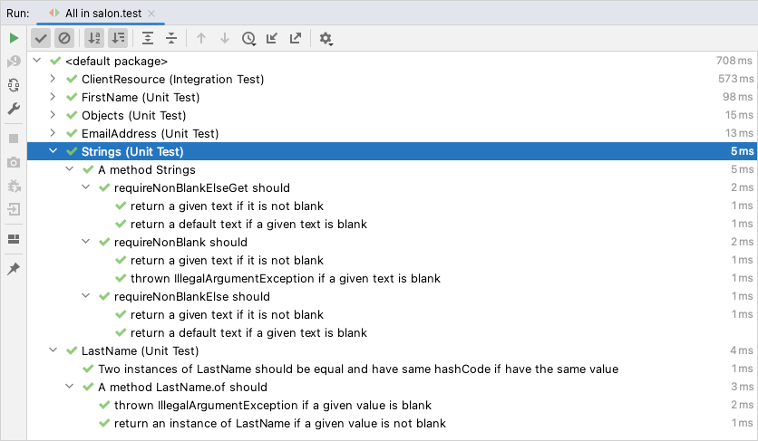

# Introduction

See a [task specification](docs/technical-test.md)

## How to upload csv files

```shell
brew install httpie
```

```shell
http -fv POST :8080/ \
  clients@src/test/resources/csv/clients.csv \
  appointments@src/test/resources/csv/appointments.csv \
  services@src/test/resources/csv/services.csv \
  purchases@src/test/resources/csv/purchases.csv
```

# Notes

## Git

I usually do not keep commit history in such high granulation on the master branch. Instead, during a merge to the master,
I squash all commits from the feature branch (preferably short living) so that there is only one commit on the master branch
that represents all the changes.

## Tests

To have human-readable displayed test names in IntelliJ IDEA, the following setting are needed:
> Build, Execution, Deployment -> Build Tools -> Gradle
> * Run tests using: **IntelliJ IDE**

The effect should be as the following:



## Null-Safety

I use a Spring annotation `@NonNullApi` on a package level to instruct IDE that my code is non-nullable,
so that IDE can detect and shows warnings about nullability (static analysis). Additionally, I use Lombok `@NonNull` to get a guaranty
that I will not receive any null values. If I need to return a value which can be null:

* if it is a public API then I return anOptional.
* otherwise I can declare it with `@Nullable` annotation, so that IDE will not rise a warning.

This way I can get much better protection from NPE in a Java. The whole idea is described here:
[Spring Null-Safety Annotations](https://www.baeldung.com/spring-null-safety-annotations)

# ToDo

* Tests (with ability to run a group)
    * Unit
    * Integration
    * E2E
    * Contract
    * Performance
* Exception handling for REST
* Tweak DB Connection Pool
* @Version -> ETag
* Last Modified Property -> Last Modifier Header
* HAL, OPTIONS
* HATEOAS
* Consumer Driven Contract
* Observability
* Currency support
* Renovate
* Mongo Repository Layer
* https://github.com/moduliths/moduliths
* Go Reactive!
* Code styles, inspections and other settings that are worth sharing with a team

# Libraries

## Implementation

* [JSR 354: Money and Currency: Moneta Reference Implementation](https://github.com/JavaMoney/jsr354-ri)
    * [JavaMoney 'Moneta' User Guide](https://github.com/JavaMoney/jsr354-ri/blob/master/moneta-core/src/main/asciidoc/userguide.adoc)
    * [Java Money and the Currency API](https://www.baeldung.com/java-money-and-currency)

## Tests

* [JUnit 5](https://junit.org/junit5/docs/current/user-guide/)
* [mockneat](https://www.mockneat.com)

# Knowledge

## General

* [The Vietnam of Computer Science](http://blogs.tedneward.com/post/the-vietnam-of-computer-science/)
* [Lombok tricks and common mistakes](https://medium.com/consulner/lombok-tricks-and-common-mistakes-fbf0ed044c3c)

## DDD & REST

* [Oliver Drotbohm](http://odrotbohm.github.io/archive/)
* [Domain-Driven Design Reference- Definitions and Pattern Summaries - Eric Evans](
  https://www.domainlanguage.com/wp-content/uploads/2016/05/DDD_Reference_2015-03.pdf)
* [Advancing Enterprise DDD](http://scabl.blogspot.com/p/advancing-enterprise-ddd.html)
* [DDD & REST - Domain Driven APIs for the web - Oliver Gierke](https://www.youtube.com/watch?v=NdZqeAAIHzc)

## Spring Boot

* [How to test a controller in Spring Boot - a practical guide](https://thepracticaldeveloper.com/guide-spring-boot-controller-tests)
* [Define a Spring RestController via Java configuration](
  https://devdreamz.com/question/172316-define-a-spring-restcontroller-via-java-configuration)

## Spring Data JDBC

* [Introducing Spring Data JDBC](https://spring.io/blog/2018/09/17/introducing-spring-data-jdbc)
* [Spring Data JDBC, References, and Aggregates](https://spring.io/blog/2018/09/24/spring-data-jdbc-references-and-aggregates)
* [The New Kid on the Block: Spring Data JDBC](https://www.youtube.com/watch?v=AnIouYdwxo0)
* [Domain-Driven Design with Relational Databases Using Spring Data JDBC](https://www.youtube.com/watch?v=GOSW911Ox6s)